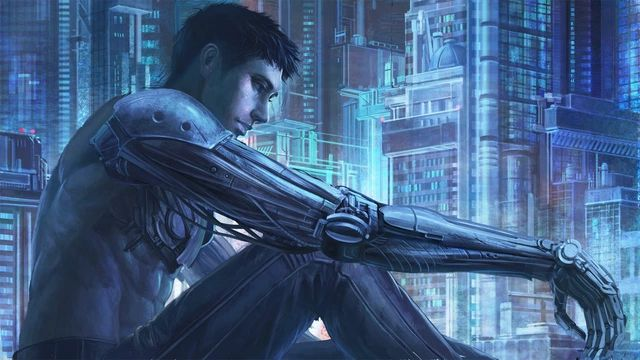

## Raul "Ricco" Willis

Raul pracoval dlouhá léta jako horník a operátor těžebních strojů. K práci se dostal díky svému otci, který pracoval ve stejném oboru. Nic ale netrvá věčně. Před dvěma lety způsobyla neodborná manipulace s technikou explozi zemního plynu v šachtě. Mnoho lidí zemřelo při závalu a na popáleniny. Raulovi způsobil zával nevratné poškození obou horních končetin.  
Raul vždy počítal s rizikem invalidity (v daném oboru to byl relativně častý jev) a platil si léta na svoje poměry drahou pojistku u dané těžební společnosti. Po havárii mu těžební společnost odmítala úraz proplatit a musel se s nimi téměř rok soudit. Nakonec svoje peníze za pomoci známých vysoudil.  
Velká část peněz ve výsledku padla na zaplacnení dluhu právníkovi, ale zůstalo mu dost, aby si mohl u MedTechu zaplatit nové bionické ruce. Zbylá částka stačila tak akorát na kvalitní nadstandardní model ve dvou provedeních.  

Nové bionické ruce sice potřebují dobíjet baterie a mají svá omezení, poskytují ale také doce slušnou výhodu v pěstním souboji, páce a dalších obdobných aktivitách. Protože byl Raul pro většinu těžebních společností "Persona non grata", nepodařilo se mu najít práci v oboru. Díky své robustní tělesné stavbě a na poměry běžných osob nestandardní síle našel práci jako vyhazovač v nočním klubu. Práce docela slušně vynáší a díky svému vzhledu je populární u zaměstnanců i zákazníků - a také adekvátně nepopulární u delikventů a potížistů.  

Raul se ve volném čase věnuje posilování, protože jeho kybernetické ruce mají vysoké nároky na fyzickou zdatnost. Ve volném čase nemá problém zajít na párty nebo se věnovat hazardu. Vyhýbá se však alkoholu, kvůli svému cvičebnímu režimu a také z obavy, že by v opilosti mohl někoho váženě zranit nebo zabít.  

---
**CHARACTER DATA:**  
|||
|:-----|:-----|
|Sex   | Male |
|Race  | Euro-Asian |
|Height| 184 cm |
|Weight| 102 kg |
|Work  | Club bouncer (ex-miner) |
|||

**STATS**  
| ST | IN | DX | HT |
|:--:|:--:|:--:|:--:|
| 12 | 09 | 10 | 12 |

---

**Advantages:**  
Cyber-arms - augmentable, extra ST  
Fit  

**Disadvantages:**  
Missing arm (both)  
Cyber-arms - fixed, batteries, electrical  
Bad reputation - mining corpos  

**Quirks:**  
Avoids alcohol  
Focus on quality food to stay healthy  

**Skills:**  
Mining technology  
Mechanics  
Electronics  
Repair (Machinery)  
First Aid  
Streetwise  
Brawling  
Lifting  
Heavy Machinery (Vehicles)  
Heavy Machinery (Mining)  
Driving (Car)  
Driving (Mining machines)  
Carousing (club parties)  
Wrestling  